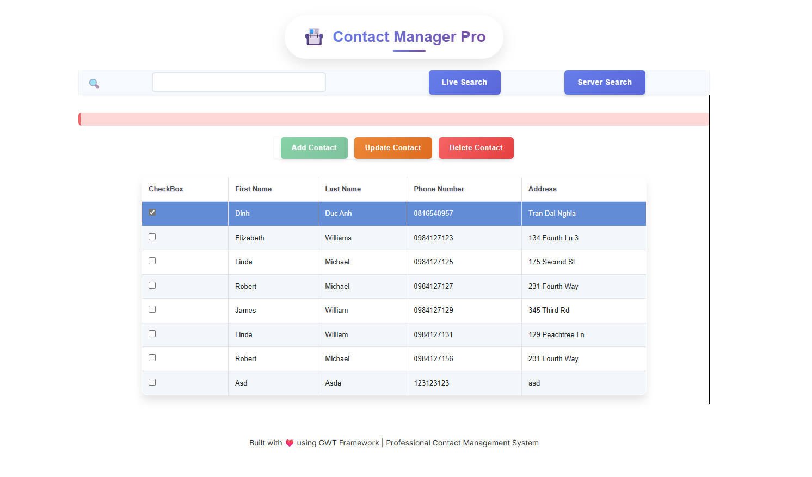
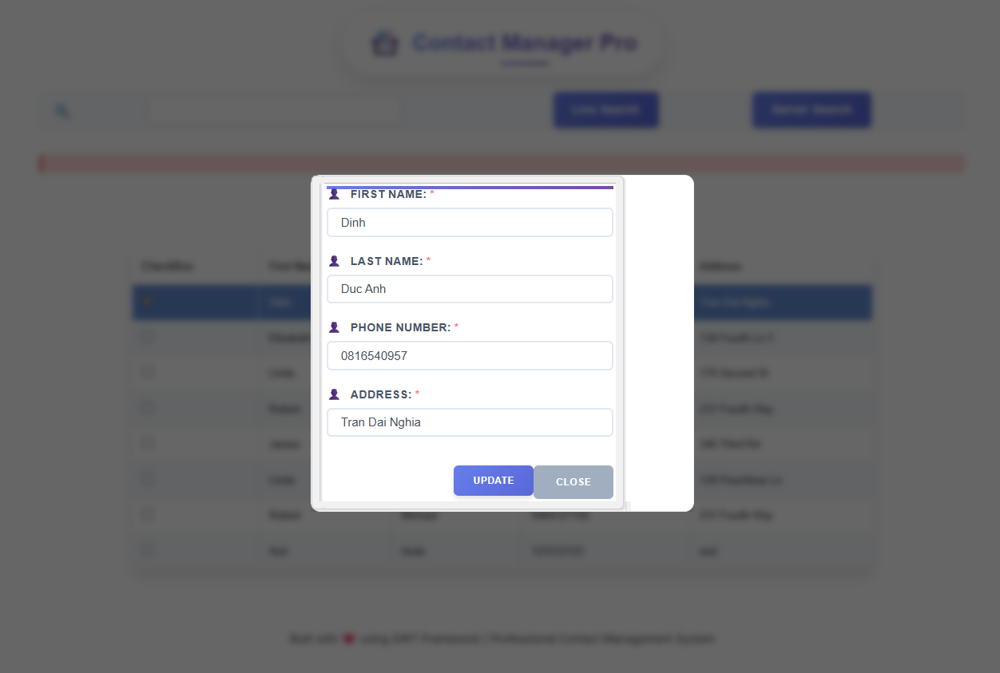

# 📇 Contact Manager Pro

> A modern, professional contact management system built with Google Web Toolkit (GWT) framework, featuring a sleek UI and comprehensive CRUD operations.


## 🌟 Overview

Contact Manager Pro is a full-featured web application designed for efficient contact management in professional environments. Built using Google Web Toolkit (GWT), it demonstrates modern web development practices with enterprise-level architecture and user experience design.

### ✨ Key Highlights

- **Modern UI/UX Design** with gradient themes and smooth animations
- **Responsive Design** that works seamlessly across all devices
- **Real-time Search** with both client-side and server-side filtering
- **Professional Styling** using modern CSS techniques and design patterns
- **Enterprise Architecture** following GWT best practices and MVP pattern

## 🚀 Features

### Core Functionality
- ✅ **Create** new contacts with comprehensive information
- ✅ **Read** and display contacts in an organized table format
- ✅ **Update** existing contact information with inline editing
- ✅ **Delete** contacts with confirmation dialogs
- 🔍 **Advanced Search** with live filtering and server-side search
- 📱 **Responsive Design** optimized for desktop, tablet, and mobile

### User Experience
- 🎨 **Modern Interface** with gradient backgrounds and glass-morphism effects
- ⚡ **Smooth Animations** for enhanced user interactions
- 🔄 **Loading States** with professional spinners and feedback
- ⌨️ **Keyboard Shortcuts** for power users (Ctrl+F for search)
- 🎯 **Intuitive Navigation** with clear visual hierarchy

### Technical Features
- 🏗️ **Clean Architecture** following GWT best practices
- 📊 **Data Management** with efficient client-server communication
- 🎭 **Professional Styling** using CSS custom properties and modern techniques
- 🔧 **Modular Design** with reusable components and UiBinder templates
- 📈 **Performance Optimized** with efficient rendering and state management

## 🛠️ Technology Stack

### Frontend
- **Google Web Toolkit (GWT)** - Main framework for web application development
- **UiBinder** - Declarative UI templates for clean separation of concerns
- **Custom CSS3** - Modern styling with variables, animations, and responsive design
- **Bootstrap 4** - Utility classes and responsive grid system

### Architecture Patterns
- **MVP (Model-View-Presenter)** - Clean separation of business logic and UI
- **Event Bus Pattern** - Decoupled communication between components
- **UiBinder Pattern** - Template-based UI development

### Design System
- **Inter Font Family** - Professional typography
- **CSS Custom Properties** - Consistent theming and color management
- **Responsive Grid System** - Mobile-first design approach
- **Modern CSS Techniques** - Flexbox, Grid, and advanced selectors

## 📁 Project Structure

```
contact-manager-pro/
├── src/
│   ├── main/
│   │   ├── java/
│   │   │   └── com/yourpackage/
│   │   │       ├── client/
│   │   │       │   ├── ui/          # UI Components
│   │   │       │   ├── presenter/   # Business Logic
│   │   │       │   └── model/       # Data Models
│   │   │       └── server/          # Server-side logic
│   │   └── resources/
│   │       └── com/yourpackage/
│   │           └── client/
│   │               ├── ui/
│   │               │   ├── ContactListView.ui.xml
│   │               │   ├── AddUpdateDialog.ui.xml
│   │               │   └── DeleteDialog.ui.xml
│   └── main/webapp/
│       ├── Demo2.html               # Main HTML file
│       ├── Demo2.css               # Enhanced styling
│       └── WEB-INF/
├── README.md
└── pom.xml                         # Maven configuration
```

## 💻 Installation & Setup

### Prerequisites
- Java JDK 8 or higher
- Maven 3.6+
- Modern web browser (Chrome, Firefox, Safari, Edge)

### Quick Start

1. **Clone the repository**
   ```bash
   git clone https://github.com/dinh1duc2anh3/Contact-Manager-Pro.git
   cd contact-manager-pro
   ```

2. **Install dependencies**
   ```bash
   mvn clean install
   ```

3. **Run the application**
   ```bash
   mvn gwt:run
   ```

4. **Open in browser**
   ```
   http://localhost:8888/Demo2.html
   ```

## 🖥️ Screenshots

### Main Interface
*Modern contact management interface with professional styling*


### Add/Edit Contact Dialog
*Intuitive form design with real-time validation*


## 🚀 Under-the-Hood Features

Beyond its polished UI, **Contact Manager Pro** offers robust, enterprise-level backend logic and data handling capabilities:

### ✅ Data Operations with Validation

* **Add & Update Contacts** with:

  * **Format validation** (e.g. phone number, name fields)
  * **Duplicate prevention** (e.g. checks if phone number already exists before saving)
* **Delete with Confirmation** ensures safe record removal

### 🔎 Flexible Search System

* **Search by multiple criteria**: first name, full name, or phone number
* **Switchable modes**: toggle between **Live Search (client-side)** and **Server-side Search**
* **Optimized filtering** using efficient string matching and RPC queries

### ☁️ Cloud-Based Data Storage

* **Google Cloud Datastore** integration for persistent storage
* Uses **Objectify** for simplified, type-safe data access
* Clean separation of concerns via **client-server RPC communication**

### ⚙️ Application Architecture

* Fully **asynchronous RPC calls** for responsive interactions
* **Logger integration** to monitor and debug client-server actions
* Clear **modular architecture**:

  * Clean separation of UI, Presenter, and Model layers
  * Code organized by feature and responsibility

## 🚀 Future Enhancements

### Planned Features
- [ ] **Advanced Filtering** with multiple criteria
- [ ] **Data Export** to CSV/Excel formats
- [ ] **Contact Categories** and tagging system
- [ ] **Bulk Operations** for managing multiple contacts
- [ ] **Data Persistence** with local storage integration
- [ ] **Import Functionality** from various file formats

### Technical Improvements
- [ ] **Unit Testing** with comprehensive test coverage
- [ ] **Performance Monitoring** and optimization
- [ ] **Accessibility Enhancements** for WCAG compliance
- [ ] **Progressive Web App** features
- [ ] **Dark Mode** theme option

### Connect with Me
- 🐙 **GitHub**: https://github.com/dinh1duc2anh3
- 📧 **Email**: dinh1duc2anh3@gmail.com

---

<div align="center">

**⭐ Star this repository if you find it helpful!**

*Built with ❤️ and modern web technologies*

</div>
